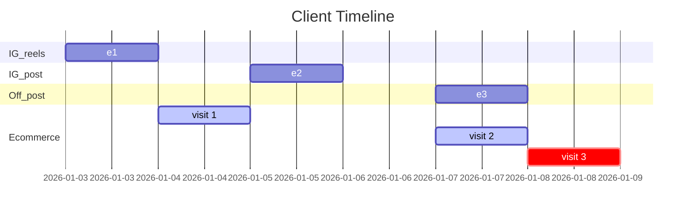
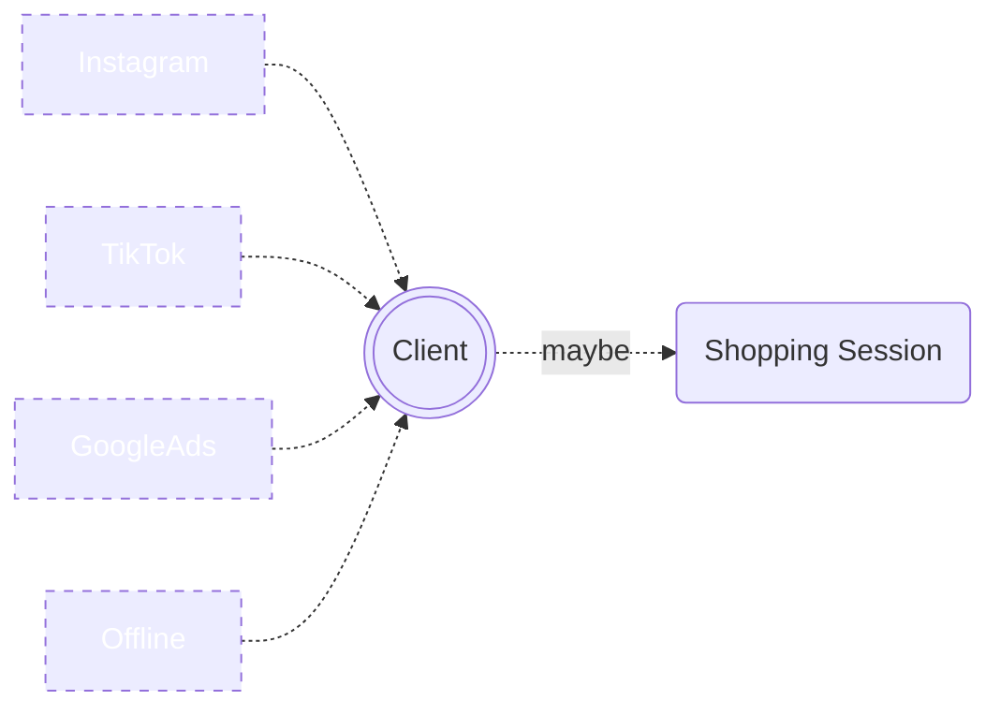
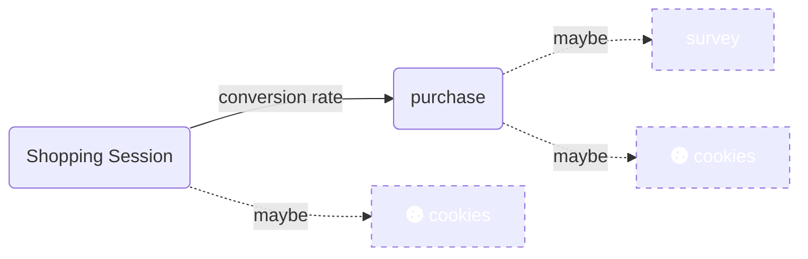

# Bayesian Attribution Model

This is an exercise to use a very simplistic bayesian model to determinate an [attribution model](https://en.wikipedia.org/wiki/Attribution_(marketing)) based on a online ecommerce example. It was build up for a study session in our DS team, its a purely demonstrative example.   

## Case Explanation 

We simulate a dataset based in a simulated example where the costumers $ c \in C$ are exposed to a set of different channels $l \in CH$. this channel set in our example will be limited to `channels = [Instagram[R,P], TikTok[R], GoogleAds[P], Offline[P]]`. We denote the variable $X_{c,l}$ as the count of expositions of the costumer $c$ to the channel $l$ (we assume that all platforms have an evergreen campaign, therefore we only care about the channel). 

We assume that the final purchase function will be given by: 

$$ IP(Y_{c,t}=1|c,X) = \theta_{c}(X_{c})*\phi_{c}(X_{c})$$

Where $Y_{c,t}$ its a variable that indicates if the client $c$ has made a purchase in the week $t$. We will model that purchase probability as the product of the visit probability $\theta_{c}(X_{c})$ and the conversion probability $\phi_{c}(X_{c})$ we assume that both functions have a [structural form](https://en.wikipedia.org/wiki/Logistic_regression) like the following:

$$  \theta_{c}(X_{c}) = \frac{1}{1+\exp(w_{c} + \sum_{l \in CH} w_{c,l}X_{c,l})}$$

where $w_{c}$ represents a bias term. We assume the same structure for $\phi_{c}(X_{c})$. The process will be described in the following plot. 

We assume that each costumer $c$ has a number of expositions during a period of time, in our case we define that period as **one month**. A typical client timeline will include a bunch of "ad-exposures", maybe some visits, and maybe a purchase at the end. In the diagram below we can see a client that in a period of a month was exposed to one post in instagram and one reel (we add them as separated channels for simplicity) and finally a exposure to an offline post (in a newspaper for example). After some of those interactions the client has made some visits to the website and made a purchase on the last visit (`visit 3`).  

We have a few data sources of this interactions, the first number that we have is a report of the number of **unique** exposures in each channel, every channel reports that number in an aggregated way, so basically what we have is $Z_{l,t} = \sum_{c \in C}X_{c,l,t}$ for a given period of time $t$. 

A second source of data reported based on a few interactions with the ecommerce. In the "pre-cookies-regulation era" there was a possibility of use the cookies to get past interaction data, In our example we will get with a `90%` of probability the access to all cookies data, and that will show, for a particular client, all the previous exposures (except from the offline channel) $X{c,l,t}$. 

There is a second source that might reveal the offline channel data. We have an optional survey that is shown at the end of a purchase. that optional survey is answered by `30%` of the costumers. On that survey we ask on what channels the costumer remember seeing an ad. We assume for simplicity that the survey is `100%` accurate for the ones that answer, we get from this survey $S_{c,l,t} = \min({X_{c,l,t},1 })$

